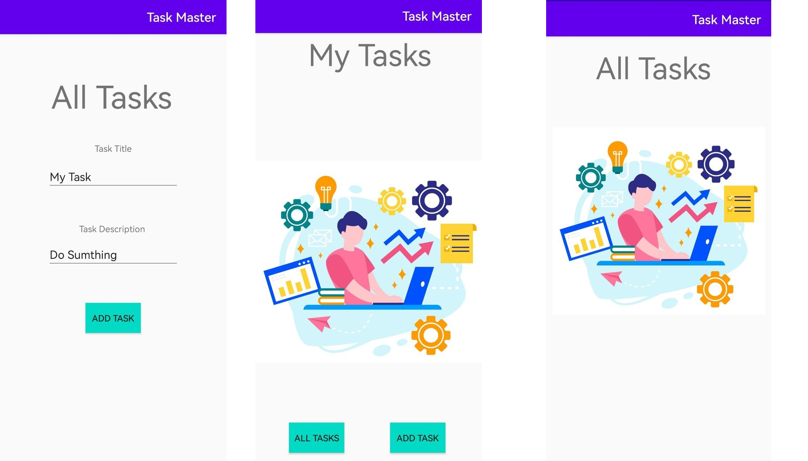
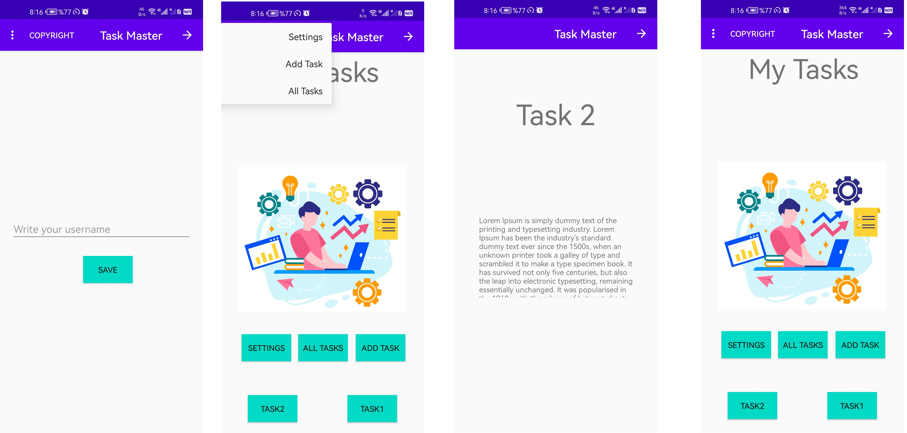
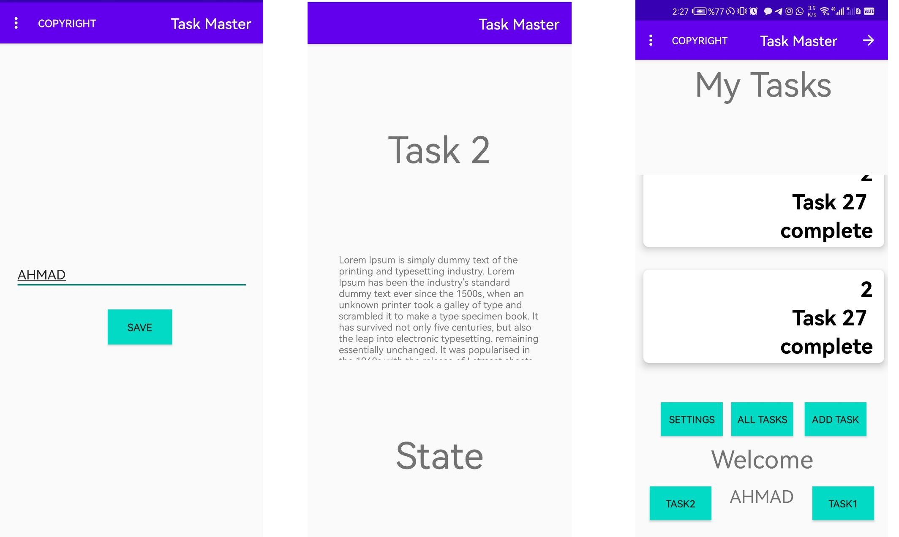

# TaskMaster
# Lab 26
- Main page -> image and two button
- Adding Task -> add two input text layout and button
- All Tasks -> add an image

# Lab 27

- Main page -> adding 3 buttons and menu
- setting page -> inpust username and submit button with SharedPreferences
- Task details page ->  title for the page and a description.
# Lab 28

- Main page -> adding username & RecyclerView
- Task details page ->  title for the page and a body and state.
- Task Model  & ViewAdapter
- setting page -> SharedPreferences active
